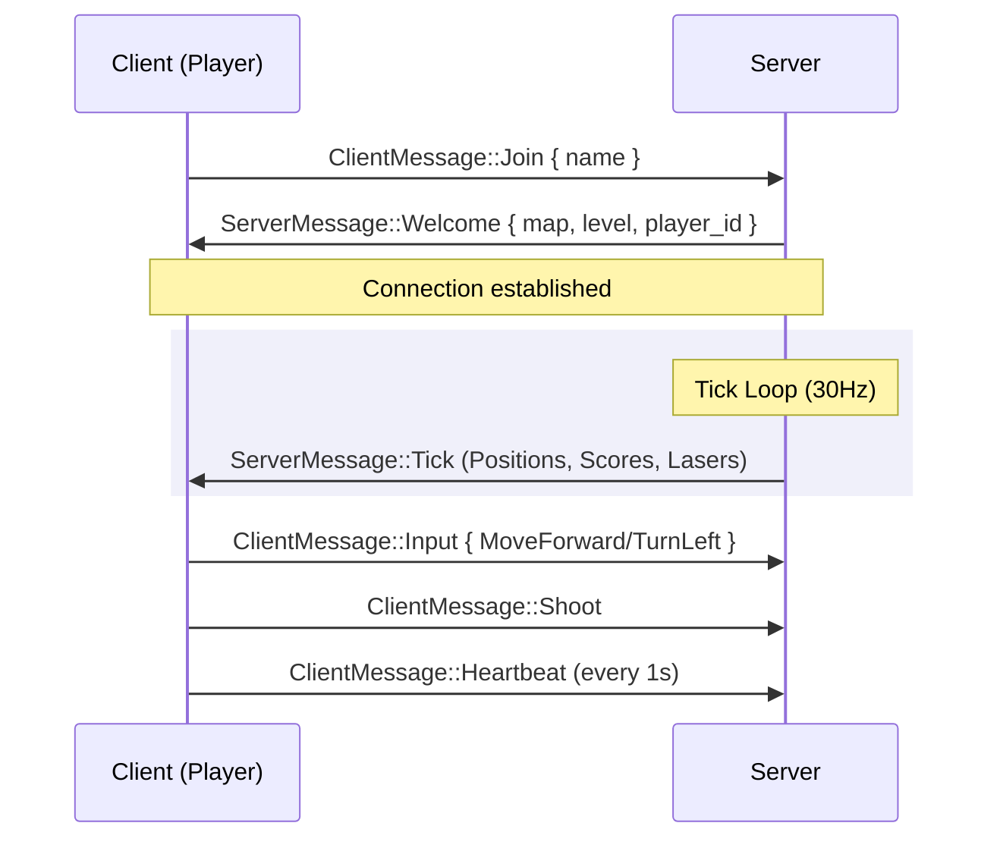
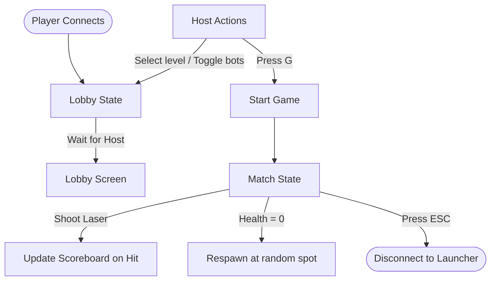

# Maze Wars 3D (multiplayer-fps) 🌌

[](https://www.rust-lang.org/)
[](#-how-the-code-works)
[](#-how-the-code-works)
[](LICENSE.md)

<p align="center">
	
	
</p>

**Maze Wars 3D** is a multiplayer 3D first-person shooter written in Rust. It's a modern tribute to the original 1974 *Maze War* game. The project uses the **Macroquad** game engine to draw a retro 3D wireframe world, standard UDP sockets for low-latency networking, and a custom raycaster built from scratch.

---

## ⚡ What's cool about it?

- **Retro 3D Raycasting**: Renders 3D walls and other players as glowing wireframe diamonds, entirely calculated using a custom DDA (Digital Differential Analysis) algorithm. No external 3D engine crates used!
- **Smooth UDP Multiplayer**: Low-latency networking that synchronizes players, bot movements, lasers, and scoreboard stats at a smooth 30Hz tick rate.
- **Sleek Connection Launcher**: A main menu screen where you can type server details, save aliases for your favorite hosts, and delete old items.
- **AI Bots**: If you don't have enough players, you can spawn smart bots to fill up the server (max 4 players total).
- **High-DPI Support**: The interface is fully responsive. It launches fullscreen, resizes dynamically, and uses sharp vector text so the HUD looks clean on any monitor.

---

## 📋 Table of Contents

- [What's cool about it?](#-whats-cool-about-it)
- [Quick Tour](#-quick-tour)
- [Screenshots](#-screenshots)
- [How the code works](#-how-the-code-works)
  - [Game Logic & Flows](#-game-logic--flows)
  - [Key Code Snippets](#-key-code-snippets)
- [Running the game locally](#-running-the-game-locally)
- [Project Files](#-project-files)
- [Authors](#-authors)

---

## 🧭 Quick Tour

1. **Connect**: Start the client. You can use the launcher menu to save and click on servers, or bypass it using command-line arguments.
2. **Lobby**: The first player to connect is crowned the **Host**. The Host can press keys `1`-`3` to switch default levels, `4` to generate a random maze, and `B` to toggle AI bots.
3. **Fight**: Once the Host presses `G` to start the game, navigate the maze using `WASD` or Arrow keys. Click your mouse or hit `Space` to shoot lasers and score points!

<p align="center">
	
</p>

---

## 📸 Screenshots

*Below are placeholders for the interface screens. You can add your own screenshots here to showcase your project.*

<div align="center">
    <table>
        <tr>
            <td align="center" width="50%">
                
                <p><strong>Connection Launcher (with Saved History)</strong></p>
            </td>
            <td align="center" width="50%">
                
                <p><strong>Match Lobby Coordinator (Max 4 Players)</strong></p>
            </td>
        </tr>
        <tr>
            <td align="center" width="50%">
                
                <p><strong>Retro 3D Raycasting Viewport & HUD</strong></p>
            </td>
            <td align="center" width="50%">
                <p><strong>Gameplay HUD & Mini-map</strong></p>
            </td>
        </tr>
    </table>
</div>

---

## 🏗 How the code works

The game uses a server-authoritative structure. The server runs the physics, movement boundaries, bot AI, and hit detection. The client reads player inputs, transmits them to the server, and draws the game state.

### 📊 Game Logic & Flows

#### 1. Client-Server Network Sequence
Here is how message exchange flows during gameplay:



#### 2. Match Progression flow
Players transition between states depending on host actions and gameplay events:



---

### 💻 Key Code Snippets

#### 1. 2D Raycasting using Digital Differential Analysis (DDA)
Instead of taking tiny steps along a ray (which is slow and can miss corners), we jump directly from one grid line to the next. This makes the wall boundaries clean and fast to compute:

```rust
pub fn raycast(
    px: f32, py: f32, angle: f32,
    map_cells: &[bool], map_width: usize, map_height: usize
) -> Option<RaycastResult> {
    let ray_dir_x = angle.cos();
    let ray_dir_y = angle.sin();
    let mut map_x = px.floor() as i32;
    let mut map_y = py.floor() as i32;

    // Calculate how far the ray travels to cross one grid square horizontal/vertical
    let delta_dist_x = if ray_dir_x.abs() < 1e-6 { 1e30 } else { (1.0 / ray_dir_x).abs() };
    let delta_dist_y = if ray_dir_y.abs() < 1e-6 { 1e30 } else { (1.0 / ray_dir_y).abs() };

    // Set up step direction and initial distance to the first grid boundary
    let (step_x, side_dist_x) = if ray_dir_x < 0.0 {
        (-1, (px - map_x as f32) * delta_dist_x)
    } else {
        (1, (map_x as f32 + 1.0 - px) * delta_dist_x)
    };

    let (step_y, side_dist_y) = if ray_dir_y < 0.0 {
        (-1, (py - map_y as f32) * delta_dist_y)
    } else {
        (1, (map_y as f32 + 1.0 - py) * delta_dist_y)
    };

    // Step through the grid until we hit a wall or run out of distance
    // (Full collision steps can be found in src/raycast.rs)
}
```

#### 2. Clean Network Packets
We use standard Rust enums to specify client inputs and server replies. Serde and Bincode convert them to compact bytes before sending them over the UDP sockets:

```rust
#[derive(Serialize, Deserialize, Debug, Clone)]
pub enum ClientMessage {
    Join { name: String },
    Input { action: PlayerAction },
    Shoot,
    RequestLevel { level_idx: usize },
    Heartbeat,
    Leave,
    StartGame,
    ToggleBots,
}
```

---

## 🚀 Running the game locally

### Setup
Ensure you have [Rust](https://rustup.rs/) installed, then fetch the codebase:

```bash
# Verify the code builds
cargo check
```

### 1. Launching the Server
By default, the server binds to port `10500` with bots enabled. You can customize this from your terminal:

```bash
# Basic start
cargo run --release --bin server

# Custom port, start with level 2, and turn off bots initially
cargo run --release --bin server -- --port 12000 --level 2 --bots false
```

### 2. Launching the Client
Running the client without arguments opens the graphical menu:

```bash
# Opens responsive main menu launcher
cargo run --release --bin client
```

To join a match immediately and bypass the launcher, add the IP and your nickname:

```bash
# Direct connect command
cargo run --release --bin client -- --ip 127.0.0.1:10500 --name Sayed
```

---

## 📁 Project Files

- `hosts_history.txt` — Saved connections history database.
- `Roboto-Regular.ttf` — Vector TTF font embedded directly into the executable.
- `getting_started.md` — Detailed setups, playing instructions, and controls.
- `src/` — Game engine modules:
  - `lib.rs` — Config variables.
  - `protocol.rs` — Network packets layout.
  - `levels.rs` — Maps and DFS maze generator.
  - `raycast.rs` — Custom DDA formulas.
- `src/bin/server/` — Server source:
  - `main.rs` — Handles network packets, players, lobby, ticks.
  - `physics.rs` — Spawn formulas, laser hits.
  - `ai.rs` — AI bot logic.
- `src/bin/client/` — Client source:
  - `main.rs` — Orchestrates game states and graphics layout.
  - `launcher.rs` — Draws launcher cards and history list.
  - `render.rs` -> Viewport drawings.
  - `minimap.rs` -> Navigational overlay.

---

## 👥 Authors

- Sayed Ahmed Husain — sayedahmed97.sad@gmail.com
- Salah Yuksel
- Qassim Aljaffer

MIT licensed (see `LICENSE.md`). Have fun playing!