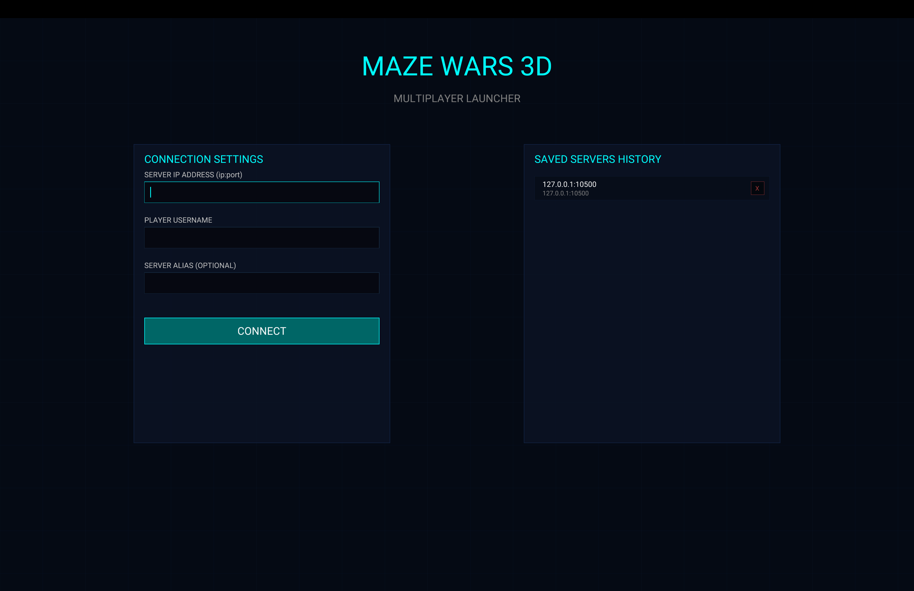
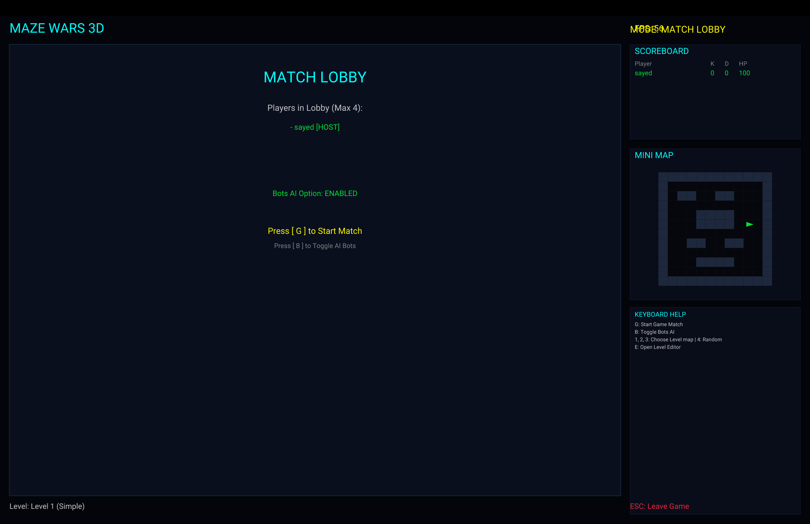
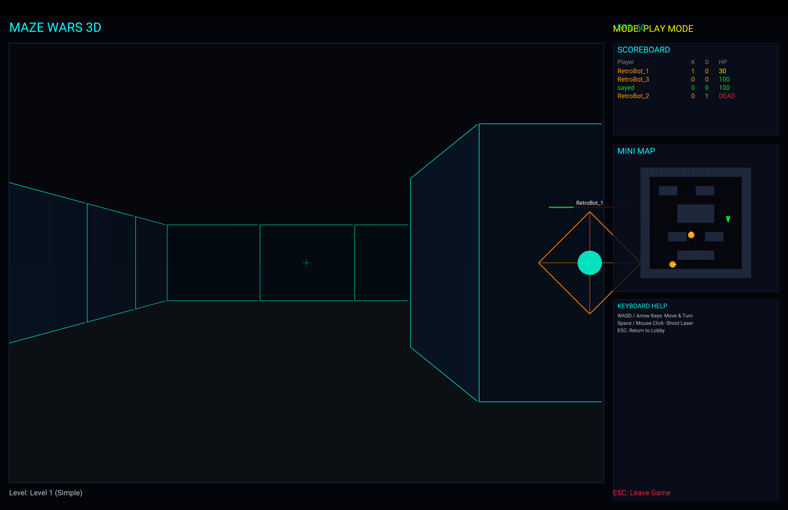
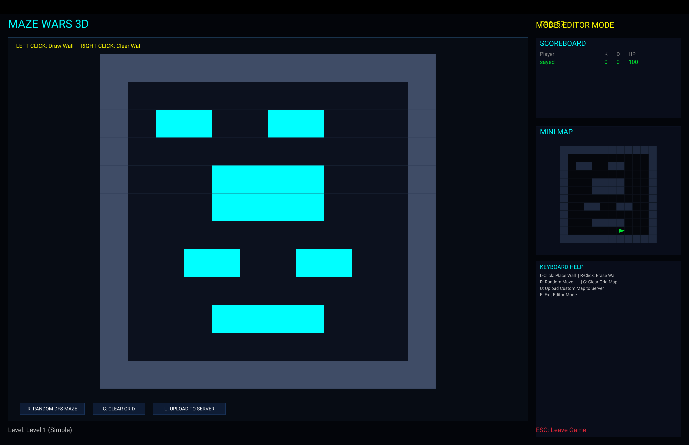
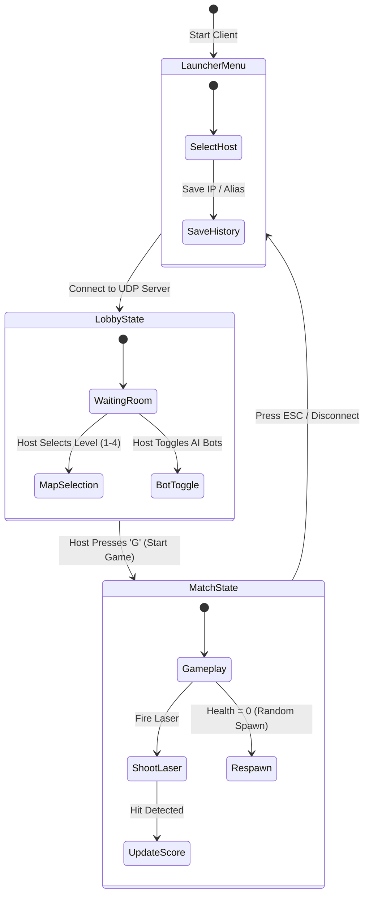

# 🌌 VectorMaze3D

[](https://www.rust-lang.org/)
[](#-system-architecture)
[](#-system-architecture)
[](LICENSE.md)

**VectorMaze3D** is a multiplayer 3D first-person shooter implemented in Rust. Featuring retro 3D raycasting, a custom Digital Differential Analysis (DDA) rendering engine written without external 3D crates, low-latency UDP socket networking (30Hz tick rate), AI bot fillers, and a connection launcher with host history persistence.

---

## ⚡ Key Highlights

- **Custom DDA Raycaster Engine**: Computes 3D wireframe wall projections and diamond player avatars natively without third-party 3D engine libraries.
- **Low-Latency UDP Multiplayer**: Authoritative server loop operating at a 30Hz tick rate for input synchronization, laser firing, hit detection, and real-time scoreboards.
- **Graphical Connection Launcher**: Main menu interface allowing users to type server addresses, store aliases, and manage host history (`hosts_history.txt`).
- **AI Bot Orchestration**: Server support for AI bot fillers (up to 4 total players) with random-walk and targeting logic.
- **Server-Authoritative Match Coordination**: Host lobby controls (`1-3` level selection, `4` procedural DFS maze generator, `B` bot toggles, `G` game start).

---

## 📋 Table of Contents

- [Key Highlights](#-key-highlights)
- [System Architecture](#-system-architecture)
- [Client-Server Packet Protocol](#-client-server-packet-protocol)
- [Match State Machine](#-match-state-machine)
- [Setup & Execution](#-setup--execution)
- [Project Directory Structure](#-project-directory-structure)
- [License](#-license)

---

## 🖼️ Game Screenshots

| Launcher Menu | Lobby & Map Selector |
| :---: | :---: |
|  |  |

| Gameplay 3D Viewport | Map Editor |
| :---: | :---: |
|  |  |

---

## 🏗️ System Architecture

```mermaid
graph TD
    subgraph Server["VectorMaze3D Server (UDP Authoritative)"]
        Loop[Server Tick Loop - 30Hz]
        Physics[Physics & Hit Detection]
        AI[AI Bot Engine]
        LobbyMgr[Lobby & Map Coordinator]
    end

    subgraph Client["VectorMaze3D Client (Macroquad GUI)"]
        Launcher[Graphical Launcher & Host History]
        DDARender[Custom DDA Raycaster 3D Viewport]
        HUD[HUD & Minimap Renderer]
        NetClient[UDP Packet Client]
    end

    Launcher -->|Select Server| NetClient
    NetClient -->|ClientMessage::Join / Input / Shoot| Loop
    Loop -->|ServerMessage::Tick & State| NetClient
    NetClient --> DDARender
    NetClient --> HUD
    Physics & AI & LobbyMgr --> Loop
```,StartLine:33,TargetContent:

---

## 📐 Client-Server Packet Protocol

```mermaid
sequenceDiagram
    participant Client as Client Process
    participant Server as UDP Authoritative Server

    Client->>Server: ClientMessage::Join { name: "Sayed" }
    Server-->>Client: ServerMessage::Welcome { map, level, player_id }
    
    rect rgb(240, 240, 250)
        Note over Server: 30Hz Server Tick Loop
        Server-->>Client: ServerMessage::Tick (Positions, Health, Lasers, Scores)
    end
    
    Client->>Server: ClientMessage::Input { action: MoveForward }
    Client->>Server: ClientMessage::Shoot
    Server->>Server: Perform Physics Raycast & Check Hit
    Server-->>Client: Broadcast Updated Health & Scoreboard
```

---

## 📐 Match State Machine



---

## 🚀 Setup & Execution

### Prerequisites

- **Rust**: Rust toolchain (1.70+) installed.

---

### Running the Server

Start the UDP server process (default port `10500`):

```bash
cargo run --release --bin server
```

Custom port, level index, and bot toggle parameters:

```bash
cargo run --release --bin server -- --port 12000 --level 2 --bots false
```

---

### Running the Client

Launch the graphical client with the host launcher menu:

```bash
cargo run --release --bin client
```

Bypass launcher and connect directly to a target server:

```bash
cargo run --release --bin client -- --ip 127.0.0.1:10500 --name Player1
```

---

## 📂 Project Directory Structure

```
vector-maze-3d/
├── Cargo.toml            # Rust manifest (name: vector-maze-3d)
├── Roboto-Regular.ttf    # Embedded vector font
├── hosts_history.txt     # Saved host connections database
├── README.md             # Documentation
└── src/
    ├── lib.rs            # Game configurations & engine parameters
    ├── protocol.rs       # Serde/Bincode UDP packet definitions
    ├── levels.rs         # Predefined maps & DFS maze generator
    ├── raycast.rs        # DDA raycasting mathematical equations
    ├── bin/
    │   ├── server/       # Authoritative UDP server, physics, and bot AI
    │   └── client/       # Macroquad renderer, launcher GUI, & minimap
```

---

## 📄 License

Distributed under the MIT License. See [LICENSE](LICENSE.md) for details.